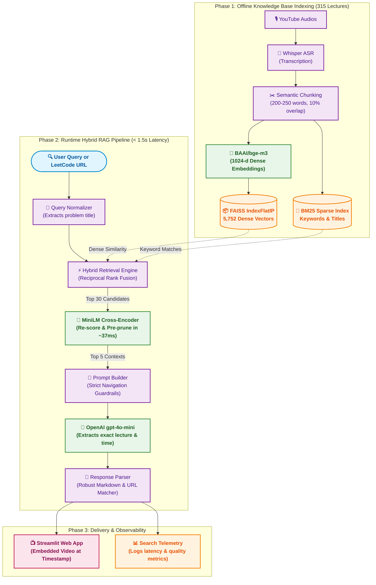

# 🎯 Project Gandalf: Striver A2Z DSA Lecture Navigator

[](https://github.com/krshnsaboo/Project-Gandalf/releases/tag/v1.1)
[](https://project-gandalf.streamlit.app)
[](https://www.kaggle.com/datasets/krshnsaboo/strivera2z)
[](https://www.python.org/downloads/)
[](LICENSE)

> **Live Demo**: [https://project-gandalf.streamlit.app](https://project-gandalf.streamlit.app)  
> **Kaggle Dataset**: [https://www.kaggle.com/datasets/krshnsaboo/strivera2z](https://www.kaggle.com/datasets/krshnsaboo/strivera2z)

**Project Gandalf** is a production-grade Video Retrieval-Augmented Generation (RAG) navigation engine designed specifically for [Striver's A2Z DSA Course](https://takeuforward.org/strivers-a2z-dsa-course/strivers-a2z-dsa-course-sheet-2) (315 lectures on YouTube).

### 🧙 Why "Project Gandalf"?
Like Gandalf in *The Lord of the Rings*, the system acts as a **wise guide rather than an answer machine**. Instead of generating abstract code solutions or forcing students to scrub through hundreds of hours of video, Gandalf pinpoints the **exact lecture, timestamp, and playable in-app video player** where Raj Vikramaditya (Striver) explains the intuition, algorithm, or problem.

---

## 🌟 What's New in v1.1

- **⚡ Sub-2-Second End-to-End Latency**: Slashed total query latency from **20+ seconds down to ~1.0–1.8s**.
- **🚀 Ultra-Fast CPU Cross-Encoder Reranker**: Integrated `cross-encoder/ms-marco-MiniLM-L-6-v2` with candidate pre-pruning, dropping rerank latency from **16.4s to 0.037s (~400x speedup)**.
- **🔍 Hybrid Search (BM25 + Dense FAISS via RRF)**: Blends keyword search with semantic vectors using Reciprocal Rank Fusion, guaranteeing exact hits for LeetCode titles, problem numbers, and specific algorithms.
- **🔗 LeetCode Problem URL Normalizer**: Paste any LeetCode problem link (e.g. `https://leetcode.com/problems/add-two-numbers/`) and Gandalf automatically extracts the problem title and navigates to the matching lecture.
- **📺 In-App Video Playback**: Embedded YouTube players inside Streamlit cards cued directly to the exact explanation timestamp.
- **📊 150-Query Benchmark Suite**: Evaluated on 150 diverse test cases with **90.67% Recall@1, 98.67% Recall@5, 99.33% Recall@10, and 0.9421 MRR**.
- **🛡️ Production Resilience**: Lazy configuration loading, OpenAI retry policies, and automated fallback to top reranked context during API outages.

---

## 📊 Benchmark Results (150-Query Suite)

Evaluated via `python evaluate.py` across 150 curated queries:

| Metric | Score | Performance Details |
| :--- | :---: | :--- |
| **Recall@1** | **90.67%** | **136 out of 150 queries** ranked target lecture at #1 |
| **Recall@5** | **98.67%** | **148 out of 150 queries** found target lecture in top 5 |
| **Recall@10** | **99.33%** | **149 out of 150 queries** found target lecture in top 10 |
| **Mean Reciprocal Rank (MRR)** | **0.9421** | High precision across all DSA domains |
| **Average Retrieval Latency** | **~0.10s** | Full 150-query suite evaluates in ~18 seconds |

---

## 🏗️ Architecture



---

## 📁 Clean Repository Structure

```text
Project Gandalf/
├── app.py                     # Streamlit web application with embedded video player
├── main.py                    # Interactive CLI search tool
├── rag_pipeline.py            # End-to-end RAG orchestrator
├── retrieval.py               # Hybrid Search: BM25 (sparse) + FAISS (dense) via RRF
├── reranker.py                # Ultra-fast cross-encoder with candidate pruning
├── prompt_builder.py          # Navigation prompts & timestamp formatting
├── llm.py                     # OpenAI client with retries & graceful fallback
├── response_parser.py         # Robust parsing of recommendations and timestamps
├── query_normalizer.py        # Extracts problem names from LeetCode URLs
├── config.py                  # Centralized configuration & lazy secrets loader
├── logger.py                  # Structured query telemetry logging
├── analyse_logs.py            # Real-time search telemetry & analytics
├── evaluate.py                # Retrieval accuracy benchmark runner
├── evaluation_queries.json    # 150 curated benchmark test cases
├── requirements.txt           # Production dependencies
├── README.md                  # Complete documentation
├── LICENSE                    # MIT License
├── .gitignore                 # Production-hardened ignore rules
│
├── tests/                     # Automated unit test suite (16 tests)
│   ├── test_response_parser.py
│   ├── test_query_normalizer.py
│   ├── test_prompt_builder.py
│   └── test_config.py
│
├── lecture_embeddings/        # Runtime vector indices
│   ├── faiss_index.bin        # 5,752 indexed passage vectors
│   ├── all_lecture_embeddings.pkl # Complete chunks & metadata
│   └── faiss_info.json
│
└── scripts/                   # One-time data prep pipelines
    ├── videos_metadata.py     # Metadata scraper using yt-dlp
    ├── create_chunks.py       # Whisper ASR transcription
    ├── merge_chunks.py        # Subtitle grouping & token bounding
    ├── absorb_tiny_chunks.py  # Tiny chunk absorption
    ├── chunk_analyzer.py      # Statistical inspection of chunks
    └── create_faiss_index.py  # FAISS index builder
```

---

## 🚀 Quickstart Guide

### 1. Prerequisites
- Python 3.10+
- OpenAI API Key

### 2. Installation
```powershell
# Clone repository
git clone https://github.com/krshnsaboo/Project-Gandalf.git
cd "Project Gandalf"

# Create and activate virtual environment
python -m venv venv
.\venv\Scripts\Activate.ps1

# Install dependencies
pip install -r requirements.txt
```

### 3. Configure Environment Variables
Create a `.env` file in the root directory:
```env
OPENAI_API_KEY=sk-your-openai-api-key-here
```

---

## 💻 Running the Application

### Launch Streamlit Web UI
```powershell
streamlit run app.py
```
Open `http://localhost:8501`. Enter any DSA problem name or paste a LeetCode URL to view the exact video timestamp with playable in-app playback.

### Run Interactive CLI
```powershell
python main.py
```

### Run Automated Unit Tests
```powershell
python -m unittest discover -s tests -p "test_*.py"
```

### Run Retrieval Evaluation Benchmark
```powershell
python evaluate.py
```

### View Real-Time Search Analytics & Latency Telemetry
```powershell
python analyse_logs.py
```

---

## ⚙️ Configuration (`config.py`)

| Setting | Default | Description |
| :--- | :--- | :--- |
| `OPENAI_MODEL` | `"gpt-4o-mini"` | OpenAI model for structuring navigation responses |
| `RERANKER_MODEL` | `"cross-encoder/ms-marco-MiniLM-L-6-v2"` | Cross-encoder model (switch to `"BAAI/bge-reranker-v2-m3"` for GPU) |
| `FAISS_TOP_K` | `30` | Candidate pool size retrieved from dense vector search |
| `RERANK_TOP_K` | `5` | Top reranked segments presented to prompt builder |
| `RERANK_MIN_SCORE` | `-5.0` | Threshold score to prune irrelevant candidate chunks |
| `USE_HYBRID_SEARCH` | `True` | Enable combined BM25 + FAISS Reciprocal Rank Fusion |
| `RRF_K` | `60` | Reciprocal Rank Fusion smoothing constant |

---

## 📄 License & Acknowledgements

- **Course Content**: Huge thanks to **Raj Vikramaditya (Striver)** for creating the incredible [Take U Forward A2Z DSA Course](https://takeuforward.org).
- **License**: Released under the [MIT License](LICENSE).
